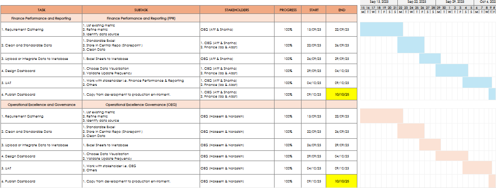
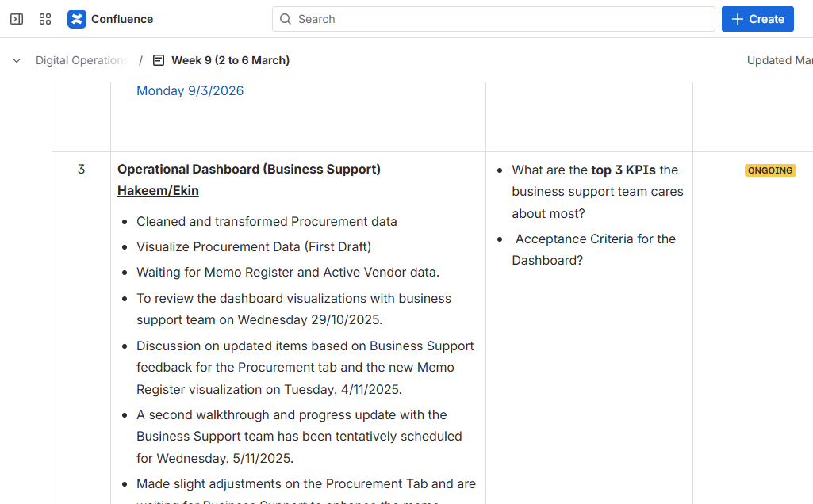

# Digital-Operations-Performance-Dashboard 📊

## 📌 Overview
This project focuses on the development of **operational performance dashboards** to support monitoring and reporting within a Digital Operations environment.  

The dashboards were designed to improve **visibility of operational KPIs, procurement activities, and SOP tracking**, enabling teams to monitor operational timelines and identify bottlenecks in daily processes.

The solution leveraged **SQL-driven queries and Metabase visualizations**, supported by structured data preparation and stakeholder requirement gathering.

---

## 🎯 Role & Responsibilities

This project involved responsibilities including:

- Conducting **requirement gathering sessions with operational stakeholders**
- Identifying **key operational KPIs and reporting metrics**
- Designing **process monitoring dashboards**
- Documenting **business requirements and dashboard specifications**
- Performing **data cleaning and transformation**
- Writing **SQL queries for data aggregation and visualization**
- Supporting **User Acceptance Testing (UAT)**
- Preparing **documentation and knowledge transfer for operational teams**

The objective was to ensure that the dashboards **aligned with operational monitoring needs while supporting data-driven decision making.**

---

## ⚠️ Problem

Before the implementation of the dashboards, operational monitoring faced several challenges:

- ❌ Limited visibility of **operational performance metrics**
- 📂 Reporting data scattered across multiple files and systems
- ⏳ Manual tracking of **SOP timelines and procurement activities**
- 📊 Lack of centralized reporting for operational initiatives
- ⚠️ Difficulty identifying delays or operational bottlenecks

These limitations made it harder for teams to **track progress and make informed operational decisions.**

---

## 💡 Solution

A set of **operational dashboards** was developed using **Metabase and SQL**, supported by structured data preparation workflows.

The solution focused on providing **clear KPI visibility for operational monitoring**.

### Dashboard Components

Two primary dashboards were developed:

#### 1️⃣ Operational Excellence & Governance (OEG) Dashboard
Focused on monitoring operational initiatives and improvement activities.

Key tabs included:

- Process Improvement Tracking
- SOP Monitoring
- Digital Initiatives Tracking
- Project Monitoring

These views allowed teams to monitor operational progress and identify areas for improvement.

#### 2️⃣ Business Support Dashboard
Focused on monitoring operational support functions.

Key sections included:

- Procurement Monitoring
- Memo Register Tracking
- Operational Reporting Metrics

The dashboards provided a centralized view of operational data, enabling teams to **monitor trends and track reporting status more efficiently.**

According to the project documentation, the dashboards were developed through **requirement gathering, data preparation, SQL query development, validation, and deployment**, ensuring alignment with operational reporting needs. :contentReference[oaicite:0]{index=0}

---
### 🧠 SQL Implementation

SQL was used to extract and transform procurement and SOP data for dashboard visualization. Queries were written to retrieve data from uploaded tables, clean and structure the fields, and prepare them for analysis and charting.

Aggregation functions such as COUNT and SUM were applied to monitor operational performance, while GROUP BY was used to categorize data based on business needs. In addition, WITH clauses (CTEs) were used in some queries to simplify logic and improve readability when handling intermediate transformations.

These queries supported dashboards such as the Memo Register and SOP monitoring, helping to track status, workload distribution, and process efficiency.

#### 📊 Memo Register Example

SELECT 
    "status",
    COUNT(*) AS total_memo,
    SUM("approval_amount") AS total_amount
FROM "metabase_upload"."cdx_procurement_2026_procument_20260330013618"
GROUP BY "status"
ORDER BY total_memo DESC;
WITH sop_summary AS (
    SELECT 
        "sop_category",
        COUNT(*) AS total_records
    FROM "metabase_upload"."cdx_sop_2026"
    GROUP BY "sop_category"
)

#### 📊 SOP Example

WITH sop_summary AS (
    SELECT 
        "sop_category",
        COUNT(*) AS total_records
    FROM "metabase_upload"."cdx_sop_2026"
    GROUP BY "sop_category"
)

SELECT *
FROM sop_summary
ORDER BY total_records DESC;

## 🔄 Dashboard Development Workflow

1️⃣ Conduct stakeholder **requirement gathering sessions**  
2️⃣ Identify **operational KPIs and reporting metrics**  
3️⃣ Clean and prepare datasets for dashboard integration  
4️⃣ Develop **SQL queries for data aggregation and filtering**  
5️⃣ Design dashboard visualizations using **Metabase**  
6️⃣ Conduct **User Acceptance Testing (UAT)** with stakeholders  
7️⃣ Deploy dashboard to the **production environment**

---

## 📊 Business Impact

The dashboards improved operational monitoring and reporting visibility.

| Metric | Before Dashboard | After Dashboard |
|------|------|------|
| KPI Visibility | Limited tracking across multiple files | Centralized operational dashboards |
| Reporting Efficiency | Manual monitoring and tracking | Automated SQL-driven reporting |
| Operational Monitoring | Difficult to identify delays | Real-time operational KPI visibility |
| Decision Support | Fragmented reporting insights | Data-driven decision support |

### 🚀 Key Outcomes

- Improved **visibility of operational KPIs**
- Reduced manual effort in operational reporting
- Enabled **faster monitoring of procurement and operational activities**
- Supported **cross-functional decision making**
- Provided structured reporting for management-level insights

---

## 🏗 Dashboard Architecture

Operational Data Sources  
↓  
Data Cleaning & Preparation  
↓  
SQL Query Development  
↓  
Metabase Visualization Layer  
↓  
Operational Dashboards for Monitoring

---

## 🛠 Tools & Technologies

- 📊 Metabase
- 🗄 SQL
- 📄 Microsoft Excel (Data Preparation)
- 📈 Data Visualization
- 📋 Business Process Documentation

---

## 📅 Project Timeline

The dashboard development followed a structured project timeline to manage deliverables and stakeholder reviews.

### Dashboard Development Timeline

---
## 📋 Project Progress Tracking

Weekly updates and project discussions were documented to track progress and align stakeholders.

### Confluence Project Updates

---
## 🧪 User Acceptance Testing (UAT)

Before deployment, **User Acceptance Testing (UAT)** was conducted with operational stakeholders to ensure:

- Accuracy of KPI calculations
- Validity of SQL queries
- Correct visualization of operational metrics
- Usability of dashboard layout

Feedback from stakeholders was incorporated before final deployment.

---

## 🔮 Future Improvements

Potential enhancements include:

- Development of **advanced BI dashboards**
- Automated KPI alerts for operational anomalies
- Historical trend analysis for operational forecasting

---

## 👨‍💻 Author

**Engku Amirul Hakeem**

Business Intelligence & Process Automation Project  

Tools Used: Metabase, SQL
